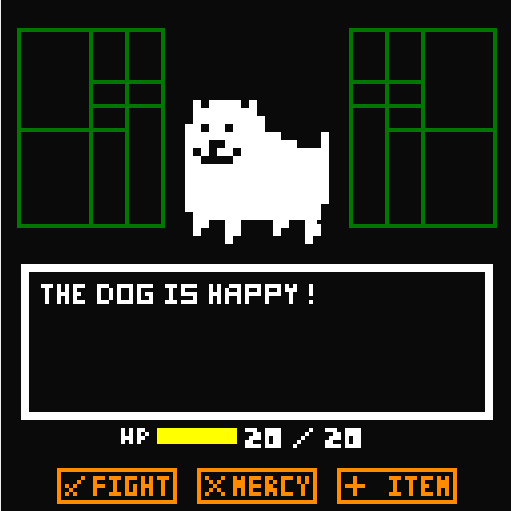
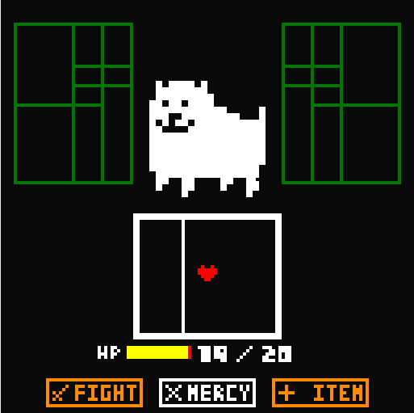

# Battletale
Game developed in MIPS Assembler Runtime Simulator (MARS), using MIPS Assembly.
Inspired in Toby Fox's Undertale.

## Plot
Howdy!

I'm Flowey!

Flowey, the flower!

I want to test you to see if you have the same determination. Your goal is simple, my dear:
Defeat the Annoying Dog.

## Gameplay

To do this, fight him to end your life, or show him mercy and just argue with him. If your life is running out, use an item to retrieve it, but remember, you only have one item.
To defend yourself from Annoying Dog, you must go through the puzzles without failing, otherwise you will take a small damage.
Good luck! ;)

## Commands
- "1234" = move / select
- "x" = confirm
- "z" = back / attack

## Observations
(1) The loading time varies in different PCs.

(2) Leave marked "Permit extended (pseudo) instructions and formats" and "Delayed branching" options in Settings.

(3) All commentaries and instructions are in portuguese.

## Licenses
 ©2017 Leonardo G Coelho. Undertale é uma obra de Toby Fox. Todos direitos reservados.
