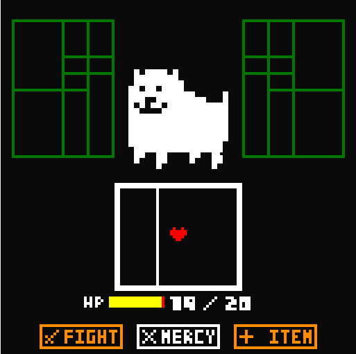

# Battletale
 #### pt/BR | <a href="https://github.com/leoGCoelho/Battletale/blob/master/README.md">en/US</a>
Jogo desenvolvido em MIPS Assembler Runtime Simulator (MARS), usando o MIPS Assembly.
Inspirado no Undertale de Toby Fox.

## Enredo
Olá!

Eu sou Flowey!

Flowey, a flor!

Eu quero testar você para ver se você tem a mesma determinação que o Fr... . Seu objetivo é simples, meu querido:
Derrote o Annoying Dog.

## Jogabilidade

Para fazer isso, lute contra ele para acabar com sua vida, ou mostre-lhe misericórdia e apenas discuta com ele. Se sua vida estiver acabando, use um item para recuperar ela, mas lembre-se, você só tem um item.
Para se defender do Annoying Dog, você deve passar pelos quebra-cabeças sem falhar, caso contrário, você terá um pequeno dano.
Boa sorte! ;)

### Comandos
- "1234" = mover / selecionar
- "x" = confirmar
- "z" = voltar / ataque

## Observações
(1) O tempo de carregamento varia em diferentes computadores.

(2) Deixe marcado "Permitir instruções estendidas (pseudo) e formatos" e "Atrasado ramificação" opções em Configurações.

(3) Todos os comentários e instruções estão em português.

## Licenças
 © 2017 Leonardo G Coelho. Undertale é uma obra de Toby Fox. Todos direitos reservados.
